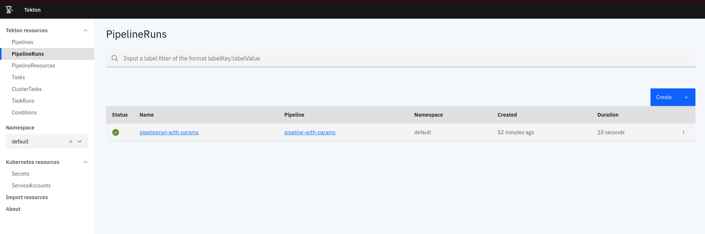
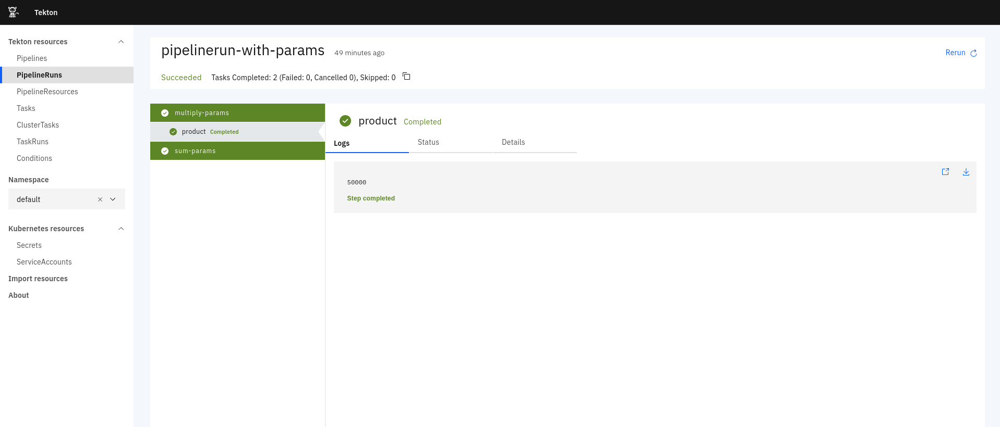

# Tektoncd Operator

The quickest and easiest way to install, upgrade and manage TektonCD [Pipelines](https://github.com/tektoncd/pipeline),
[Dashboard](https://github.com/tektoncd/dashboard), [Triggers](https://github.com/tektoncd/triggers)
on any Kubernetes Cluster.

## Prerequisites

- Kubernetes Cluster
- `kubectl`
- `tkn` ([tektoncd/cli](https://github.com/tektoncd/cli#installing-tkn))

# Quick Start

## Install Tektoncd Operator

To install the latest version of Tektoncd Operator, run

```shell script
kubectl apply -f https://storage.googleapis.com/tekton-releases/operator/latest/release.notags.yaml
...
namespace/tekton-operator created
customresourcedefinition.apiextensions.k8s.io/tektonaddons.operator.tekton.dev created
customresourcedefinition.apiextensions.k8s.io/tektonpipelines.operator.tekton.dev created
deployment.apps/tekton-operator created
clusterrole.rbac.authorization.k8s.io/tekton-operator created
clusterrolebinding.rbac.authorization.k8s.io/tekton-operator created
serviceaccount/tekton-operator created
```

This will install the operator in `tekton-operator` namespace. Then the operator will automatically install
 Tekton Pipelines in the `tekton-pipelines` namespace.

### Check Tektoncd Pipelines Installation

 Run
 ```shell script
tkn version
...
Client version: 0.10.0
Pipeline version: v0.15.1
Triggers version: unknown
```

or check

```shell script
kubectl get tektonpipelines cluster -o jsonpath='{.status.conditions[0]}'
---
map[code:installed version:v0.15.1]
```

### Run an Example Pipeline

Run an example pipeline from Tektoncd Pipelines examples: [Pipeline Run with Params](https://github.com/tektoncd/pipeline/blob/release-v0.15.x/examples/v1beta1/pipelineruns/pipelinerun-with-params.yaml)

```shell script
kubectl apply -f https://raw.githubusercontent.com/tektoncd/pipeline/release-v0.15.x/examples/v1beta1/pipelineruns/pipelinerun-with-params.yaml
...
pipeline.tekton.dev/pipeline-with-params created
task.tekton.dev/sum-params created
task.tekton.dev/multiply-params created
pipelinerun.tekton.dev/pipelinerun-with-params created
```

### Get PipelineRun Logs

```shell script
tkn pipelinerun ls
...
NAME                      STARTED        DURATION     STATUS
pipelinerun-with-params   1 minute ago   10 seconds   Succeeded
```

```shell script
tkn pipelinerun logs -f pipelinerun-with-params
...
[sum-params : sum] 600

[multiply-params : product] 50000
```

## Installing Dashboard

### Prerequisite

At present the operator need to add `cluster-admin` clusterrole to install Tektoncd Dashboard.

```shell script
kubectl create clusterrolebinding tekton-operator-cluster-admin --clusterrole cluster-admin --serviceaccount tekton-operator:tekton-operator
---
clusterrolebinding.rbac.authorization.k8s.io/tekton-operator-cluster-admin created
```
### Install Dashboard

Tektoncd Dashboard can be installed by creating an instance of TektonAddon CRD.

create `tekton-dashboard.yaml`

```yaml
apiVersion: operator.tekton.dev/v1alpha1
kind: TektonAddon
metadata:
  name: dashboard
spec:
  # Add fields here
  version: v0.8.2
```

Create the resource on the cluster.

```shell script
kubectl apply -f tekton-dashboard.yaml
...
tektonaddon.operator.tekton.dev/dashboard created
```

### Check Install status

```shell script
kubectl get tektonaddon dashboard -o jsonpath='{.status.conditions[0]}'
---
map[code:installed version:v0.8.2]
```

wait the Tekton Dashboard Deployment and Service comes up

```shell script
kubectl get deploy,svc -n tekton-pipelines
---
NAME                                          READY   UP-TO-DATE   AVAILABLE   AGE
deployment.apps/tekton-dashboard              1/1     1            1           8m55s
deployment.apps/tekton-pipelines-controller   1/1     1            1           31m
deployment.apps/tekton-pipelines-webhook      1/1     1            1           30m

NAME                                  TYPE        CLUSTER-IP   EXTERNAL-IP   PORT(S)                     AGE
service/tekton-dashboard              ClusterIP   10.0.5.197   <none>        9097/TCP                    8m56s
service/tekton-pipelines-controller   ClusterIP   10.0.14.97   <none>        9090/TCP                    31m
service/tekton-pipelines-webhook      ClusterIP   10.0.0.201   <none>        9090/TCP,8008/TCP,443/TCP   31m
```

### Accessing Tekton Dashboard

we can access the Tekton Dashboard by exposing the `service/tekton-dashboard`. ([port-forward](https://kubernetes.io/docs/tasks/access-application-cluster/port-forward-access-application-cluster/) or by creating an ingress)
Reference:
- on minikube: https://kubernetes.io/docs/tasks/access-application-cluster/ingress-minikube/
- on KIND:  https://kind.sigs.k8s.io/docs/user/ingress/
- refer to platform specific documentation if your using a managed Kubernets cluster (eg: AKS, EKS, GKE...)

Once the Tekton Dashboard is accesible, we can see Pipelines, PipelineRuns, logs etc.

**PipelineRuns**


**PipelineRun Logs**


## Installing Tekton Triggers

Tektoncd Triggers can be installed by creating an instance of TektonAddon CRD.

create `tekton-triggers.yaml`

```yaml
apiVersion: operator.tekton.dev/v1alpha1
kind: TektonAddon
metadata:
  name: trigger
spec:
  # Add fields here
  version: v0.7.0
```

Create the resource on the cluster.

```shell script
kubectl apply -f tekton-triggers.yaml
---
tektonaddon.operator.tekton.dev/triggers created
```

### Check Install status

```shell script
tkn version
---
Client version: 0.10.0
Pipeline version: v0.15.1
Triggers version: v0.7.0
```

### Using Tekton Triggers

Please refer [Tektoncd/Triggers: Event Triggering with Tekton](https://github.com/tektoncd/triggers)

# Tekton Operator CRDs

## The TektonPipelines CRD

This is a sample of [TektonPipelines cr](config/crds/operator_v1alpha1_pipeline_cr.yaml)

```
apiVersion: operator.tekton.dev/v1alpha1
kind: TektonPipeline
metadata:
  name: cluster
spec:
  targetNamespace: tekton-pipelines
```
The crd is `Cluster scope`, and `targetNamespace` means `Tekton Pipleine` will installed in it.  

Note: The operator creates the cr automatically, means `Tekton Pipeline` will be installed automatic when Operator installed.
To change the behavior, you could add argument: `no-auto-install=true` to config/operator.yaml, like this:  

```
...
    spec:
      serviceAccountName: tekton-operator
      containers:
        - name: tekton-operator
          image: ko://github.com/tektoncd/operator/cmd/manager
          imagePullPolicy: Always
          args:
          - --no-auto-install=true
...
```

Then reset the Operator `Tekton Pipeline` manually:

```shell script
ko delete -f config

ko apply -f config
```

## TektonAddon components

Supported tektonaddon components are installed by creating the 'tektonaddon' CR for the component.

Sample CR

```
apiVersion: operator.tekton.dev/v1alpha1
kind: TektonAddon
metadata:
  name: dashboard
spec:
  version: v0.8.2
```

The current supported components and versions are:

- dashboard
  - openshift-v0.8.2
  - v0.8.2
- extensionwebhooks
  - v0.2.0
  - openshift-v0.2.0
  - v0.6.1
- trigger
  - v0.7.0

# References

- [Development Guide](docs/README.md)
