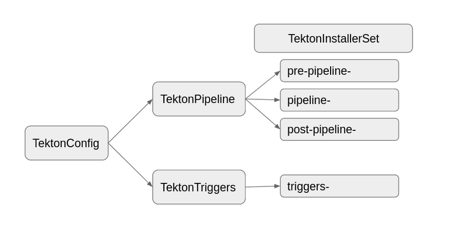

<!--
---
linkTitle: "Internals of Operator"
weight: 7
---
-->
# Internals of Operator

Tekton Operator installs and manages lifecycle of Tekton Projects.

Tekton has multiple subprojects such as `tektoncd/pipeline`, `tektoncd/triggers`. In Operator each subproject has a CRD and a Controller which manages its lifecycle.

For ex. `tektoncd/pipeline` is managed by `TektonPipeline` CRD and its controller,
`tektoncd/triggers` is managed by `TektonTrigger` CRD and its controller


### TektonConfig

As each subproject has a CRD, to install them user has to create a CR instance for each one of them. 

To simplify the installation for users, there is an additional CRD `TektonConfig` which will creates other CR for subprojects on behalf of user and user just have to deal with only one CR.

TektonConfig will create TektonPipeline, TektonTriggers and other component CR based on the profile passed to it.

- `profile` is a field in `spec` of `TektonConfig` which determines which all components to install.

TektonConfig also provide feature of autopruning, so it is recommended to install components through TektonConfig instead of creating each CR individually.

Below, we have an example for `basic` profile where `TektonConfig` will create only `TektonPipeline` and `TektonTriggers`.




### TektonInstallerSet

TektonInstallerSet is an internal CRD which is created by other components and which has job to create resources passed by other components and report back the status to the owner.

When `TektonConfig` is created based on profile, it will `TektonPipeline` and other components.

Now, `TektonPipeline` has to install it's component so
- it will read the release file which has all the kubernetes resources required to install pipeline
- it will do transformation on the resources like changing the namespace of resources, adding owner reference and other required changes
- after transformation, it will create an TektonInstallerSet with the transformed Resources.

Once the TektonInstallerSet is created, its reconciler will read the resources from `spec` and create them, if already created them update them.

TektonInstallerSet has only one field i.e. `manifest` array where we pass the resources which a component want to create.

```
apiVersion: operator.tekton.dev/v1alpha1
kind: TektonInstallerSet
metadata:
  name: foo
spec:
  manifests: []
```

### Internals of TektonInstallerSet

Before creating resources, TektonInstallerSet adds owner reference in the resources.
- For CRDs, the owner will be the owner of TektonInstallerSet.

Ex. `TektonPipeline` creates `TektonInstallerSet` which has CRDs, the owner of CRDs will be `TektonPipeline` because we don't want CRDs to get deleted when we delete `TektonInstallerSet`. Why? we will see in the `Why TektonInstallerSet?` section.

- All Resources except CRDs, the owner will be the `TektonInstallerSet` which is creating them.

`TektonInstallerSet` creates resources in an order like it creates CRDs first, then Cluster Scoped Resources, then Namespace Scoped Resources and so on. You can find the complete order [here](https://github.com/tektoncd/operator/blob/f600b959f323e8dd16d963e0b896c44fcba959b4/pkg/reconciler/kubernetes/tektoninstallerset/tektoninstallerset.go#L75).
If something goes wrong at the first step, then it will return from there and skip installing rest of the resources. So, while debugging it is easier to look what went wrong and where.


After installing the resources, `TektonInstallerSet` waits for deployment pods to come in running state and then report back the status through CR status.

### Why TektonInstallerSet?

- Seamless Upgrades

  When we upgrade to a new version, the component reconciler just need to delete existing `TektonInstallerSet` and create new `TektonInstallerSet` with the new resources.

- Removing Obsolete resources

  When we upgrade and delete older `TektonInstallerSet` we delete the older resource, which will removes any obsolet resource which is not in the new verison.

- Changing Target Namespace
  
  If user want to change the installation namespace of pipelines, triggers the respective reconcilers just have to delete existing `TektonInstallerSet` and create a new one with updated target namespace.

- Preserving User Data
  
  When we delete an `TektonInstallerSet` while upgrading or changing target installation namespace, all resources gets deleted except CRDs which preserve the user data.

- Extension Resources

  As we have extension mechanism where we handle platform specific resources, in case of OpenShift we create additional resources in Pre and Post Reconciler in TektonPipeline. In both the cases we have an `TektonInstallerSet` created, on upgrade or target namespace change we delete the old and create a new `TektonInstallerSet`. 

